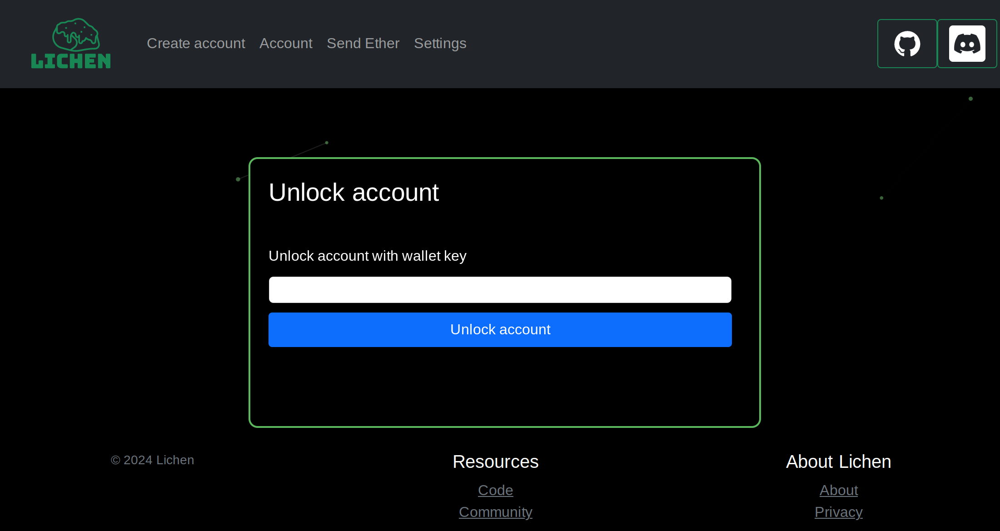

# Lichen

Lichen is an Ethereum utility that runs locally on your desktop with a focus on privacy and security.

---

### Features

- Account wallet credentials are stored encrypted and decrypted only when the client is in use and unlocked by the account key.

- Create multiple accounts.

- Send Ether. 

- Lookup other addresses if multiple were created.

- Soon to be cross-platform.

- Works as an auto-signer if unlocked for other desktop app integrations.

- Stay tuned for more exciting features. 

---

### Install from .deb file release

#### Steps to install

- Download the deb file from the latest release.

https://github.com/B3nac/Lichen/releases

- Run the install command.

`sudo dpkg -i lichen-release`

- Start Lichen from `/usr/bin/Lichen` or from Lichen app shortcut via the Show Applications menu.

---

### Setup from source

Dependencies for Ubuntu 20.04.

`sudo apt install build-essential git pkg-config python3-dev python3-venv libgirepository1.0-dev libcairo2-dev gir1.2-webkit2-4.0 libcanberra-gtk3-module`

I highly recommended creating a virtual environment to avoid dependency conflicts.

`python3 -m venv envname`

Once the venv is created source it in order to install the dependencies to that environment.

`source path/to/envname/bin/activate`

Install briefcase and required dependencies.

`pip install briefcase Flask web3 cyptography Flask-WTF toga`

Start app in Dev mode.

`briefcase dev`

Build and run the app.

`briefcase run`

---

### Customize default settings

You can customize the default network and ethereum account with a `config.ini` file. If you don't have a `config.ini` file LichenWallet will use the first public address created as the default address.

Example `config.ini` file:

```bash
[DEFAULT]

network = https://goerli-rollup.arbitrum.io/rpc
default_address = your_public_ethereum_address
ens_mainnet_node = your_mainnet_node_url
```

### Preview screenshot



### Supporting development

TBD.

