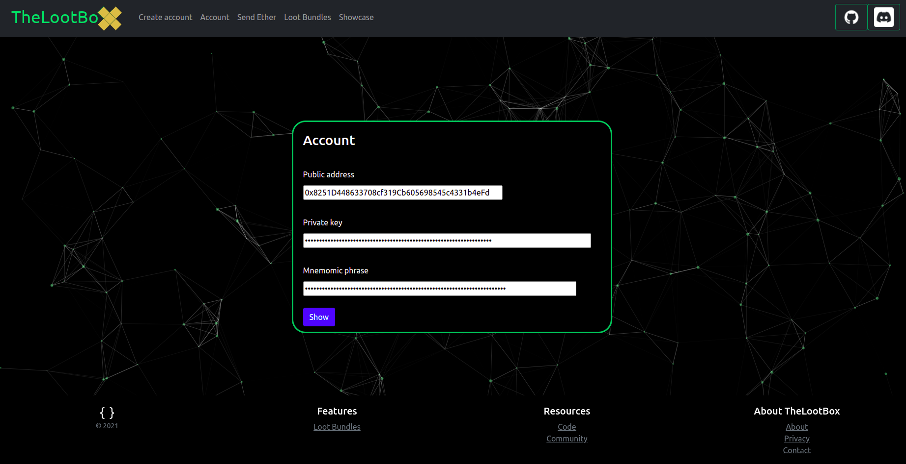

# TheLootBoxWallet

Built on Linux for Linux and ported to other operating systems in the future. No ads, no user tracking, and security is a priority. Protect your loot with TheLootBoxWallet! 

TheLootBoxWallet is a Ethereum wallet that runs locally on your desktop with a focus on privacy and security. A lockbox for your ethereum assets.

---

### Features

- Account wallet credentials are stored encrypted and decrypted only when the client is in use and unlocked by the account key.

- Runs locally as a stand-alone application.

- Makes it easier to create "loot bundles" more explanation on what those are later. :)

---

### Start from binary

---

### Setup from source

I highly recommended creating a virtual environment to avoid dependency conflicts.

`python3 -m venv envname`

Once the venv is created source it in order to install the dependencies to that environment.

`source path/to/envname/bin/activate`

Clone TheLootBox repository from Github.

`git clone git@github.com:TheLootBox-xyz/TheLootBoxClient.git`

The required dependencies can be installed with pip.

`pip install -r requirements.txt`
 
Then start TheLootBoxClient.

`python3 start.py`

---

### Preview screenshot

### In progress

~~- Setting up TheLootBox contract functions.~~

~~- Add setup instructions.~~

~~- Add multiple account support.~~

- Add unit tests.

- Add Tor integration for account alerts

### Supporting development

If you would like to send anything to my ens name `b3nac.eth` it will be appreciated, but is obviously not required.
